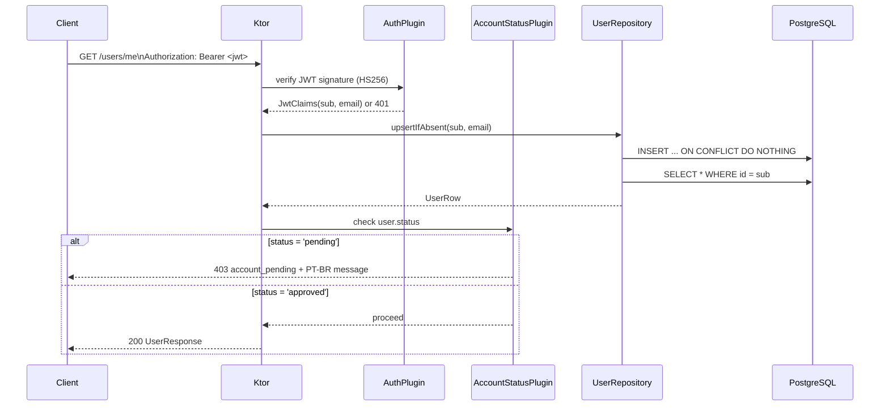

# Backend Auth — Design

**Spec**: `.specs/features/backend-auth/spec.md`
**Status**: Draft

---

## Architecture Overview

The Ktor server adopts a **plugin-per-concern** structure: each cross-cutting capability
(database, auth, serialization, routing) is wired through a dedicated `configure*()` function
installed in `Application.module()`. This pattern is idiomatic Ktor and keeps `Application.kt`
as a thin orchestrator.

The request lifecycle for a protected route:



### JWT Verification Detail

Supabase signs access tokens with **HS256** using `SUPABASE_JWT_SECRET`. Ktor verifies the
signature only — no issuer check in MVP (Supabase project URLs vary by env). The JWT payload
carries `sub` (UUID) and `email`.

```
Token arrives → Algorithm.HMAC256(secret) verifier → extract sub + email
                                                     → JWTPrincipal in call context
```

---

## Code Reuse Analysis

### Existing Components to Leverage

| Component | Location | How to Use |
|---|---|---|
| `SERVER_PORT` constant | `shared/src/commonMain/.../Constants.kt` | Keep using in `Application.kt` |
| `logback.xml` | `server/src/main/resources/logback.xml` | Add structured log patterns for DB/auth events |
| `Application.kt` `module()` | `server/src/main/kotlin/.../Application.kt` | Extend with `configure*()` calls |

### New Dependencies Required

> **Note:** Verify latest stable versions at task time from Maven Central / official changelogs.

| Library | Module | Purpose |
|---|---|---|
| `ktor-server-auth` | `io.ktor:ktor-server-auth-jvm` | `Authentication` plugin base |
| `ktor-server-auth-jwt` | `io.ktor:ktor-server-auth-jwt-jvm` | `jwt()` provider (wraps `java-jwt`) |
| `ktor-server-content-negotiation` | `io.ktor:ktor-server-content-negotiation-jvm` | JSON request/response serialization |
| `ktor-serialization-kotlinx-json` | `io.ktor:ktor-serialization-kotlinx-json-jvm` | `kotlinx.serialization` converter |
| `ktor-server-status-pages` | `io.ktor:ktor-server-status-pages-jvm` | Centralized exception → HTTP response |
| `exposed-core` | `org.jetbrains.exposed:exposed-core` | Exposed ORM DSL |
| `exposed-jdbc` | `org.jetbrains.exposed:exposed-jdbc` | JDBC execution layer |
| `exposed-kotlin-datetime` | `org.jetbrains.exposed:exposed-kotlin-datetime` | `kotlinx.datetime` column types |
| `postgresql` | `org.postgresql:postgresql` | JDBC driver for Supabase PostgreSQL |
| `hikaricp` | `com.zaxxer:HikariCP` | Connection pool |

All Ktor modules share the existing `ktor = "3.4.1"` version catalog entry.
Exposed and HikariCP/PG driver versions must be added to `libs.versions.toml`.

---

## Package Structure

```
server/src/main/kotlin/com/example/pompeiarunners/
├── Application.kt                  ← install all configure*() + env validation
├── config/
│   └── AppConfig.kt                ← env loading; fail-fast on missing vars
├── plugins/
│   ├── DatabasePlugin.kt           ← HikariCP + Exposed.connect + migration
│   ├── AuthPlugin.kt               ← JWT verification + challenge blocks
│   ├── AccountStatusPlugin.kt      ← pending-account gate (403 + PT-BR message)
│   ├── SerializationPlugin.kt      ← ContentNegotiation + JSON
│   └── RoutingPlugin.kt            ← installs route modules
├── db/
│   └── UsersTable.kt               ← Exposed Table object (schema definition)
├── models/
│   ├── UserRow.kt                  ← domain model (DB ↔ Kotlin)
│   ├── UserResponse.kt             ← @Serializable API response
│   └── UpdateProfileRequest.kt     ← @Serializable PATCH body
├── repositories/
│   └── UserRepository.kt           ← upsertIfAbsent, findById, updateProfile, approve
└── routes/
    ├── UserRoutes.kt               ← GET /users/me, PATCH /users/me
    └── CoachRoutes.kt              ← GET /coach/pending-users, POST /users/{id}/approve
```

---

## Components

### `AppConfig`

- **Purpose**: Load and validate required env vars at startup; fail fast with a clear message if any are missing.
- **Location**: `config/AppConfig.kt`
- **Interfaces**:
  - `AppConfig.load(): AppConfig` — reads env, throws `IllegalStateException` with missing var name
  - `data class AppConfig(val databaseUrl: String, val jwtSecret: String)`
- **Dependencies**: stdlib only
- **Reuses**: nothing (new)

---

### `DatabasePlugin` — `configureDatabase(config: AppConfig)`

- **Purpose**: Create HikariCP datasource from `DATABASE_URL`, connect Exposed, run `public.users` migration.
- **Location**: `plugins/DatabasePlugin.kt`
- **Interfaces**:
  - `Application.configureDatabase(config: AppConfig)` — installed in `module()`
- **Key behaviour**:
  - HikariCP `dataSourceClassName = "org.postgresql.ds.PGSimpleDataSource"` with `DATABASE_URL`
  - `Database.connect(hikariDataSource)` — Exposed global connection
  - `transaction { SchemaUtils.create(UsersTable) }` — idempotent (`CREATE TABLE IF NOT EXISTS`)
  - Logs `"Database connected"` at INFO on success; exception propagates and crashes server on failure
- **Dependencies**: `AppConfig`, `UsersTable`, HikariCP, Exposed, PG driver
- **Reuses**: existing `logback.xml` logger

---

### `UsersTable`

- **Purpose**: Exposed Table object that maps to `public.users` schema.
- **Location**: `db/UsersTable.kt`
- **Schema**:
  ```kotlin
  object UsersTable : Table("public.users") {
      val id        = uuid("id")
      val name      = text("name").nullable()
      val email     = text("email")
      val phone     = text("phone").nullable()
      val photoUrl  = text("photo_url").nullable()
      val role      = text("role").default("runner")
      val status    = text("status").default("pending")   // 'pending' | 'approved'
      val createdAt = timestampWithTimeZone("created_at") // exposed-kotlin-datetime
      override val primaryKey = PrimaryKey(id)
  }
  ```
- **Dependencies**: Exposed core, `exposed-kotlin-datetime`
- **Reuses**: nothing (new)

---

### `AuthPlugin` — `configureAuth(config: AppConfig)`

- **Purpose**: Install Ktor `Authentication` with a `jwt("supabase")` provider; return structured JSON on auth failure.
- **Location**: `plugins/AuthPlugin.kt`
- **Interfaces**:
  - `Application.configureAuth(config: AppConfig)` — installed in `module()`
- **JWT configuration**:
  ```
  verifier: JWT.require(Algorithm.HMAC256(config.jwtSecret)).build()
  validate:  JWTPrincipal(credential.payload)   ← non-null = valid
  challenge: respond with JSON error body based on failure type
  ```
- **Challenge error mapping**:
  | Failure | Body |
  |---|---|
  | No `Authorization` header | `{"error": "missing_token"}` |
  | Signature invalid / tampered | `{"error": "invalid_token"}` |
  | Token expired | `{"error": "token_expired"}` |
- **Dependencies**: `AppConfig`, `ktor-server-auth-jwt`
- **Reuses**: `SerializationPlugin` (JSON response)

---

### `SerializationPlugin` — `configureSerialization()`

- **Purpose**: Install `ContentNegotiation` with `kotlinx.serialization` JSON.
- **Location**: `plugins/SerializationPlugin.kt`
- **Interfaces**:
  - `Application.configureSerialization()` — installed in `module()`
- **Config**: `install(ContentNegotiation) { json() }` — default lenient JSON
- **Dependencies**: `ktor-server-content-negotiation`, `ktor-serialization-kotlinx-json`

---

### `StatusPagesPlugin` — `configureStatusPages()`

- **Purpose**: Map exceptions to HTTP responses centrally (no try/catch in routes).
- **Location**: `plugins/StatusPagesPlugin.kt`
- **Error mappings**:
  | Exception | Status | Body |
  |---|---|---|
  | `ContentTransformationException` | 400 | `{"error": "invalid_body"}` |
  | `DatabaseUnavailableException` (custom) | 503 | `{"error": "database_unavailable"}` |
  | `ProfileSyncException` (custom) | 500 | `{"error": "profile_sync_failed"}` |
- **Dependencies**: `ktor-server-status-pages`

---

### `AccountStatusPlugin` — `configureAccountStatus()`

- **Purpose**: After lazy sync, block any authenticated user whose `status = 'pending'` with 403 + PT-BR feedback message. Runs as a pipeline interceptor inside `authenticate("supabase")` blocks.
- **Location**: `plugins/AccountStatusPlugin.kt`
- **Interfaces**:
  - `Application.configureAccountStatus()` — installed in `module()` after `configureAuth()`
- **Intercept logic** (executes after `currentUser()` populates `UserRow`):
  ```
  if (userRow.status == "pending") {
      respond 403 {
          "error": "account_pending",
          "message": "Espere o treinador aprovar sua criação de conta"
      }
      finish()
  }
  ```
- **Bypass**: users with `role = 'coach'` or `role = 'admin'` are NOT auto-bypassed — a coach also starts as `pending` and must be approved. A developer-approved coach account is the bootstrap path.
- **Dependencies**: `UserRepository`, `ktor-server-auth`
- **Reuses**: `currentUser()` helper from `UserRoutes`

---

### `UserRepository` (updated interface)

- **Purpose**: All DB access for `public.users` — no SQL outside this class.
- **Location**: `repositories/UserRepository.kt`
- **Interfaces**:
  ```kotlin
  suspend fun upsertIfAbsent(id: UUID, email: String): UserRow
  suspend fun findById(id: UUID): UserRow?
  suspend fun updateProfile(id: UUID, name: String?, phone: String?, photoUrl: String?): UserRow
  suspend fun findPendingUsers(): List<UserRow>
  suspend fun approveUser(id: UUID): UserRow?   // null = not found
  ```
- **`upsertIfAbsent` strategy**:
  1. `transaction { UsersTable.insertIgnore { ... } }` — ON CONFLICT DO NOTHING
  2. `transaction { UsersTable.selectAll().where { UsersTable.id eq id }.single() }` — always returns row
  3. If SELECT finds no row after insert failure → throw `ProfileSyncException`
- **`updateProfile`**: only updates non-null fields (partial update), returns updated row
- **Dependencies**: Exposed DSL, `UsersTable`, `UserRow`
- **Reuses**: nothing (new)

---

### `UserRoutes` — `configureRouting()`

- **Purpose**: Mount `GET /users/me` and `PATCH /users/me` under the `supabase` JWT auth guard.
- **Location**: `routes/UserRoutes.kt`
- **Route structure**:
  ```
  authenticate("supabase") {
      get("/users/me")   → lazy sync → findById → UserResponse
      patch("/users/me") → lazy sync → updateProfile → UserResponse
  }
  ```
- **Lazy sync**: extracted to a helper `ApplicationCall.currentUser(repo)` that runs `upsertIfAbsent` and caches the `UserRow` in `call.attributes`
- **Field guard on PATCH**: `role` and `email` are silently ignored (not part of `UpdateProfileRequest`)
- **Dependencies**: `UserRepository`, models, `AuthPlugin`

---

### `CoachRoutes`

- **Purpose**: Endpoints for coaches to inspect and act on pending accounts.
- **Location**: `routes/CoachRoutes.kt`
- **Route structure**:
  ```
  authenticate("supabase") {
      get("/coach/pending-users")    → requireRole("coach", "admin") → findPendingUsers()
      post("/users/{id}/approve")    → requireRole("coach", "admin") → approveUser(id)
  }
  ```
- **`requireRole` execution order**: runs AFTER `AccountStatusPlugin` — a pending coach cannot call these endpoints (developers bootstrap the first coach account by directly setting `status = 'approved'` in Supabase dashboard).
- **`POST /users/{id}/approve` behaviour**:
  - Parse `id` path param as UUID; 400 on malformed UUID
  - `approveUser(id)` → null → 404 `{"error": "user_not_found"}`
  - Already approved → returns 200 with unchanged profile (idempotent)
- **Dependencies**: `UserRepository`, `requireRole()`, `AccountStatusPlugin`

---

### P2: Role Guard — `requireRole(vararg roles: String)`

- **Purpose**: Return 403 if the authenticated user's DB role doesn't satisfy the requirement.
- **Location**: `routes/RoleGuard.kt` (extension on `ApplicationCall`)
- **Interface**:
  ```kotlin
  suspend fun ApplicationCall.requireRole(vararg allowed: String)
  // throws RespondException(403, {"error": "insufficient_role"}) if not satisfied
  ```
- **Source of role**: `call.currentUser(repo).role` — loaded by `currentUser()` helper
- **Not yet wired**: no routes require role guard in P1; designed for race/registration endpoints

---

### P2: Maintenance Mode

- **Purpose**: Short-circuit all non-admin requests when maintenance flag is active.
- **Location**: `plugins/MaintenancePlugin.kt`
- **Storage**: `AtomicBoolean` in `Application.attributes[MaintenanceKey]`
- **Intercept point**: `application.intercept(ApplicationCallPipeline.Call)` — before routing
- **Bypass**: requests where authenticated user's role is `admin` pass through
- **Toggle**: direct attribute mutation (no endpoint in P1 — admin sets via env/restart for MVP)

---

## Data Models

### `UserRow` (domain — internal)

```kotlin
data class UserRow(
    val id: UUID,
    val name: String?,
    val email: String,
    val phone: String?,
    val photoUrl: String?,
    val role: String,
    val status: String,      // "pending" | "approved"
    val createdAt: Instant   // kotlinx.datetime.Instant
)
```

### `UserResponse` (API — serialized to JSON)

```kotlin
@Serializable
data class UserResponse(
    val id: String,
    val name: String?,
    val email: String,
    val phone: String?,
    @SerialName("photo_url") val photoUrl: String?,
    val role: String,
    val status: String,      // "pending" | "approved"
    @SerialName("created_at") val createdAt: String   // ISO-8601
)
```

**Mapping**: `UserRow.toResponse()` extension — `id.toString()`, `createdAt.toString()`

### `UpdateProfileRequest` (API — deserialized from PATCH body)

```kotlin
@Serializable
data class UpdateProfileRequest(
    val name: String? = null,
    val phone: String? = null,
    @SerialName("photo_url") val photoUrl: String? = null
)
```

**Note**: `role` and `email` are absent — silently ignored by design (AUTH-06 AC-2).

---

## Error Handling Strategy

| Scenario | Where Caught | Status | Body |
|---|---|---|---|
| Missing `Authorization` header | JWT challenge | 401 | `{"error": "missing_token"}` |
| Invalid / tampered token | JWT challenge | 401 | `{"error": "invalid_token"}` |
| Expired token | JWT challenge | 401 | `{"error": "token_expired"}` |
| Authenticated user with `status = 'pending'` | `AccountStatusPlugin` | 403 | `{"error": "account_pending", "message": "Espere o treinador aprovar sua criação de conta"}` |
| Insufficient role (coach routes) | `requireRole()` helper | 403 | `{"error": "insufficient_role"}` |
| Target user not found on approve | `CoachRoutes` | 404 | `{"error": "user_not_found"}` |
| DB unreachable | `StatusPages` | 503 | `{"error": "database_unavailable"}` |
| Profile sync failure (non-conflict) | `StatusPages` | 500 | `{"error": "profile_sync_failed"}` |
| Malformed JSON body | `StatusPages` | 400 | `{"error": "invalid_body"}` |
| Malformed UUID path param | `CoachRoutes` | 400 | `{"error": "invalid_body"}` |
| Missing JWT `email` claim | `UserRepository` | — | fallback `""`, log WARN |
| PATCH with `role`/`email` in body | `UpdateProfileRequest` | — | fields absent, silently dropped |
| Duplicate key race on insert | `insertIgnore` | — | conflict ignored, SELECT proceeds |
| Maintenance mode active (P2) | intercept pipeline | 503 | `{"error": "maintenance"}` |

---

## Tech Decisions

| Decision | Choice | Rationale |
|---|---|---|
| ORM style | Exposed **DSL** (not DAO) | Less ceremony for simple tables; SQL stays visible |
| Connection pool | HikariCP | Exposed's recommended pool; handles Supabase's connection limits |
| JWT issuer validation | Skipped in MVP | Supabase issuer URL varies by project/env; secret is sufficient for HS256 |
| Lazy sync trigger | Every authenticated request | Zero extra infra vs webhooks; upsert is idempotent and fast after first hit |
| Role source | `public.users.role` (DB) | JWT claims don't carry role — keeps role management server-side |
| Partial PATCH | Absence = no-update | Field present = update that field; absent = leave unchanged (no `null` = delete ambiguity) |
| Exposed coroutines | `newSuspendedTransaction` | Ktor routes are coroutines; avoid blocking the event loop |
| Approval default | `status = 'pending'` on every new user | Forces explicit coach action; safer than opt-out |
| Coach bootstrap | Direct SQL in Supabase dashboard | No chicken-and-egg endpoint; zero scope for MVP |
| Rejection flow | Not implemented in v1 | Not requested; can be added as `POST /users/{id}/reject` later |

---

## Startup Sequence

```
main()
  → AppConfig.load()            fail-fast: DATABASE_URL, SUPABASE_JWT_SECRET
  → configureDatabase(config)   connect HikariCP → Exposed → migrate UsersTable (+ status col)
  → configureAuth(config)       install JWT("supabase") provider
  → configureAccountStatus()    install pending-account gate interceptor
  → configureSerialization()    install ContentNegotiation + JSON
  → configureStatusPages()      install exception → HTTP mapping
  → configureRouting()          mount /users/me + /coach routes
  → embeddedServer.start()      ready
```

### Bootstrap Note — First Coach Account

The `AccountStatusPlugin` blocks all pending users, including coaches. The first coach account
must be bootstrapped by a developer setting `status = 'approved'` directly in Supabase dashboard
SQL editor:

```sql
UPDATE public.users SET status = 'approved' WHERE email = 'coach@example.com';
```

Subsequent coaches can be approved by any already-approved coach via `POST /users/{id}/approve`.
